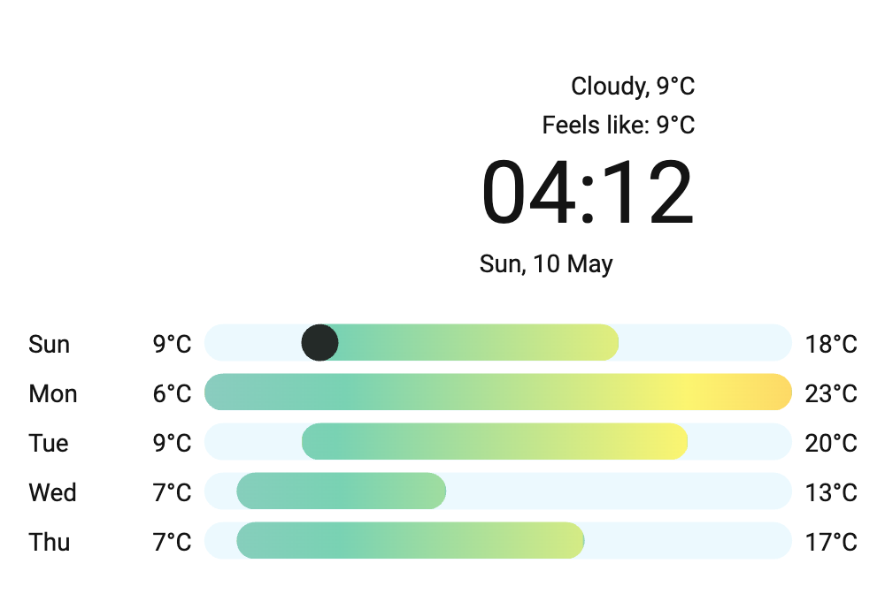

# Tablet Clock Card

Lovelace card for Home Assistant — digital clock + weather forecast tuned for wall-mounted tablet kiosks.



Forked from [pkissling/clock-weather-card](https://github.com/pkissling/clock-weather-card) with customisations for our kiosk layout. Weather icons by [basmilius](https://github.com/basmilius/weather-icons).

## Install (HACS custom repository)

1. HACS → ⋮ menu → **Custom repositories**
2. URL: `https://github.com/tggo/tablet-clock-card` · Type: **Lovelace**
3. Install.
4. Resource is auto-registered as `/hacsfiles/tablet-clock-card/tablet-clock-card.js`.

## Install (manual)

```bash
mkdir -p config/www/community/tablet-clock-card
wget -O config/www/community/tablet-clock-card/tablet-clock-card.js \
  https://raw.githubusercontent.com/tggo/tablet-clock-card/main/tablet-clock-card.js
```

Add resource: `/local/community/tablet-clock-card/tablet-clock-card.js` (module).

## Minimal config

```yaml
type: custom:tablet-clock-card
entity: weather.forecast_home
```

## Full config

```yaml
type: custom:tablet-clock-card
entity: weather.forecast_home
sun_entity: sun.sun
temperature_sensor: sensor.outdoor_temperature
apparent_sensor: sensor.feels_like_temperature
humidity_sensor: sensor.outdoor_humidity
weather_icon_type: line     # line | fill
animated_icon: true
forecast_rows: 5
hourly_forecast: false      # true = next hours, false = next days
locale: en-GB
time_pattern: HH:mm
time_format: 24
date_pattern: ccc, d LLLL
hide_today_section: false
hide_forecast_section: false
show_humidity: false
show_decimal: false
hide_clock: false
hide_date: false
use_browser_time: false
time_zone: Europe/Kyiv
```

## Build from source

```bash
npm install --legacy-peer-deps
npm run build
# → dist/tablet-clock-card.js
```

## License

MIT — see [LICENSE](LICENSE). Original work © 2022 Patrick Kissling.
